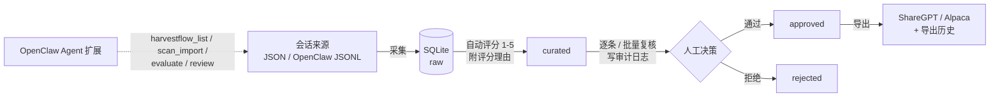

# HarvestFlow

本地化的 AI Agent 会话数据采集与审核系统：**采集 → 自动评分 → 人工复核 → 导出训练格式**。

[](https://github.com/mcocdaa/HarvestFlow/actions/workflows/ci.yml)
[](https://github.com/mcocdaa/HarvestFlow/releases)
[](LICENSE)

## 为什么是 HarvestFlow

- **本地优先，数据不出机**：FastAPI + SQLite + 本地文件，`docker compose` 单机一键起，不依赖任何云平台；可选 Bearer 鉴权
- **与 OpenClaw 双向打通**：服务端插件解析 OpenClaw v3 导出并给出专用评分；扩展仓库向 OpenClaw Agent 暴露 `harvestflow_*` 工具（列表 / 采集 / 评分 / 复核）
- **可解释的自动评分**：每份评分附带理由（工具调用成功、多步决策链、明确输出、消息数），不是黑盒分数
- **完整闭环与审计**：`raw → curated → approved/rejected` 状态机 + 唯一落库入口 + 全链路审计日志（人工修改同样留痕）
- **插件热插拔**：Collector / Curator / Service 三类插件已落地，before/after 短路钩子；替换评分算法无需改编排
- **后端能力全量上界面**：全中文 UI（React 18 + Ant Design 5），六个页面覆盖采集 / 会话 / 审核 / 导出 / 插件

## 工作流



## 与常见方案对比

| 维度 | HarvestFlow | 云端标注平台 | 自研采集脚本 |
|------|-------------|--------------|--------------|
| 数据位置 | 本地 SQLite / 文件 | 上传云端 | 本地 |
| 采集格式 | JSON + OpenClaw JSONL 插件 | 手动上传 | 需自行实现 |
| 自动评分 | 插件化 + 评分理由 | 视平台 | 无 |
| 人工复核 | 逐条 / 批量 + 审计日志 | 有 | 无 |
| 导出 | ShareGPT / Alpaca + 历史回看 | 视平台 | 手动脚本 |
| Agent 主动上报 | OpenClaw 扩展工具 | 少见 | 无 |
| 部署 | Docker 单机 / 源码 | SaaS | 脚本自维护 |

## 快速开始（Docker，推荐）

前置：[Docker](https://docs.docker.com/get-docker/)（含 Compose v2）。

```bash
git clone https://github.com/mcocdaa/HarvestFlow.git
cd HarvestFlow
cp .env.example .env          # 可选：修改端口 / 鉴权 / 扫描目录
docker compose up -d --build  # 首次构建需要几分钟
```

| 服务 | 地址 |
|------|------|
| 前端 | http://localhost:8001 |
| 后端 API 文档 (Swagger) | http://localhost:3001/docs |

使用预构建镜像（跳过本地构建）：

```bash
cp .env.example .env
docker compose pull && docker compose up -d
```

> 预构建镜像发布在 GHCR：`ghcr.io/mcocdaa/harvestflow-backend`、`ghcr.io/mcocdaa/harvestflow-frontend`。
> `main` 分支为 `latest`（linux/amd64），`v*` 标签发布版本号（linux/amd64 + arm64）。

也可以使用一键脚本（等价，会自动创建 `.env`）：

```bash
./scripts/start.sh dev full   # 停止请用 ./scripts/stop.sh dev
```

### 不用 Compose：docker run

```bash
docker network create harvestflow

docker run -d --name harvestflow-backend --network harvestflow \
  -p 3001:3000 \
  -v "$PWD/backend/data:/app/data" \
  -v "$PWD/plugins:/app/plugins:ro" \
  ghcr.io/mcocdaa/harvestflow-backend:latest

docker run -d --name harvestflow-frontend --network harvestflow \
  -p 8001:8000 \
  ghcr.io/mcocdaa/harvestflow-frontend:latest
```

### 修改配置

```bash
vim .env                # 修改端口、鉴权、扫描目录等
docker compose up -d    # 让配置生效
```

前端相关变量（`VITE_*`）在构建时注入，修改后需重建：`docker compose up -d --build`。

## 本地开发（源码模式）

前置：[uv](https://docs.astral.sh/uv/)（后端依赖管理）、Node.js 18+（推荐 24）。

```bash
./scripts/start.sh local full      # 后端 :3000 + 前端 :5173
./scripts/start.sh local backend   # 仅后端
./scripts/start.sh local frontend  # 仅前端
./scripts/stop.sh local            # 停止
```

首次启动会自动 `cp .env.example .env`，并按锁文件安装前后端依赖。

## 功能界面

界面为全中文，图标全部使用 SVG（`@ant-design/icons`）：

| 页面 | 能力 |
|------|------|
| 概览 | 状态分布环形图、平均自动评分/通过率、待审核入口、最近会话、清洗器状态，一键运行自动清洗 |
| 会话 | 状态筛选与排序、对话与工具调用查看、编辑（状态流转/评分/标签/工具）、删除、单条自动评分 |
| 审核 | 逐条评审（评分/意见/快捷键）、批量通过或拒绝、审计日志（可按会话过滤） |
| 采集 | 监听目录增删、目录扫描、单条/批量导入与结果汇总 |
| 导出 | ShareGPT / Alpaca、最低分/角色/任务/标签筛选、导出历史（含筛选条件回看）与路径复制 |
| 插件 | 插件卡片（采集器/清洗器/服务）、启停开关（停用需确认） |

## 配置说明

完整配置见 [.env.example](.env.example)，常用项：

| 配置项 | 默认值 | 说明 |
|--------|--------|------|
| `BACKEND_EXTERNAL_PORT` / `FRONTEND_EXTERNAL_PORT` | `3001` / `8001` | Docker 对外端口 |
| `PORT` | `3000` | 本地源码模式后端端口 |
| `HARVESTFLOW_API_KEY` / `VITE_API_KEY` | 空 | Bearer 鉴权，留空关闭；设置后需重建前端 |
| `WATCH_FOLDERS` | 空 | 默认扫描目录（自动监听采集见 Roadmap） |
| `OPENCLAW_AGENTS_DIR` | 空 | OpenClaw 导出数据目录（如 `./backend/data/test_sessions/agents`） |
| `CURATOR_ENABLED` / `AUTO_APPROVE_THRESHOLD` | `true` / `4` | 自动审核开关与自动通过阈值 |
| `LOG_LEVEL` | `INFO` | `DEBUG` / `INFO` / `WARNING` / `ERROR` |
| `DATA_DIR` / `DB_PATH` / `PLUGINS_DIR` | `./backend/data` 等 | 本地路径；Docker 内部固定为 `/app/*` |

## API 概览

完整交互式文档：http://localhost:3001/docs

| 方法 | 路径 | 说明 |
|------|------|------|
| GET/PATCH/DELETE | `/api/v1/sessions/{id}` | 会话详情 / 更新 / 删除 |
| GET | `/api/v1/stats` | 统计信息 |
| GET/POST | `/api/v1/collector/scan`、`import`、`import-all` | 采集与导入 |
| GET/POST | `/api/v1/curator/status`、`evaluate/{id}`、`evaluate-all` | 自动审核 |
| GET/POST | `/api/v1/reviewer/pending`、`approve/{id}`、`reject/{id}`、`batch-*` | 人工审核 |
| GET/POST | `/api/v1/exporter/formats`、`export`、`history` | 导出 |
| GET/POST | `/api/v1/plugins`、`enable`、`disable` | 插件管理 |

> 鉴权：设置 `HARVESTFLOW_API_KEY` 后，`/api/*` 需携带 `Authorization: Bearer <key>`；`/health` 不受限制。

## 插件开发

插件接口定义、开发指南与配置说明见 [plugins/README.md](plugins/README.md)；架构与 Hook 机制见 [docs/project/architecture_guide.md](docs/project/architecture_guide.md)。

已落地 Collector / Curator / Service 三类插件；Reviewer 插件体系预留目录，规划见 Roadmap。

## 项目结构

```
HarvestFlow/
├── backend/                 # FastAPI + SQLite（uv 管理依赖）
│   ├── api/v1/              # HTTP 路由
│   ├── core/                # 配置/数据库/插件/钩子等基础设施
│   ├── managers/            # 采集/审核/导出等业务逻辑
│   └── tests/               # pytest
├── frontend/                # React 18 + Ant Design 5 + ProComponents + Recharts + Vite
├── plugins/                 # 采集/审核/服务插件 + OpenClaw 扩展子模块
├── scripts/                 # start.sh / stop.sh
├── docs/                    # 架构/插件/定位等文档
├── docker-compose.yml       # 单文件编排
└── .env.example             # 配置模板
```

## Roadmap

**v1.1（规划）**

- 真实目录监听：新文件自动导入、监听列表持久化、前端监听状态
- 导出文件下载：浏览器直接下载，支持批量打包
- Reviewer 插件体系：`plugins/reviewers/` 加载约定、后端钩子与前端扩展字段
- 技术债：Hook 双分发合并、数据库连接模型、SQL 参数化

详细说明见 [future_plan.md](future_plan.md)。

## 许可证

[MIT](LICENSE)
