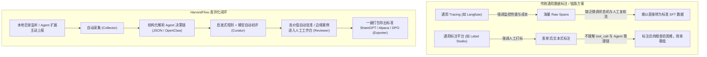
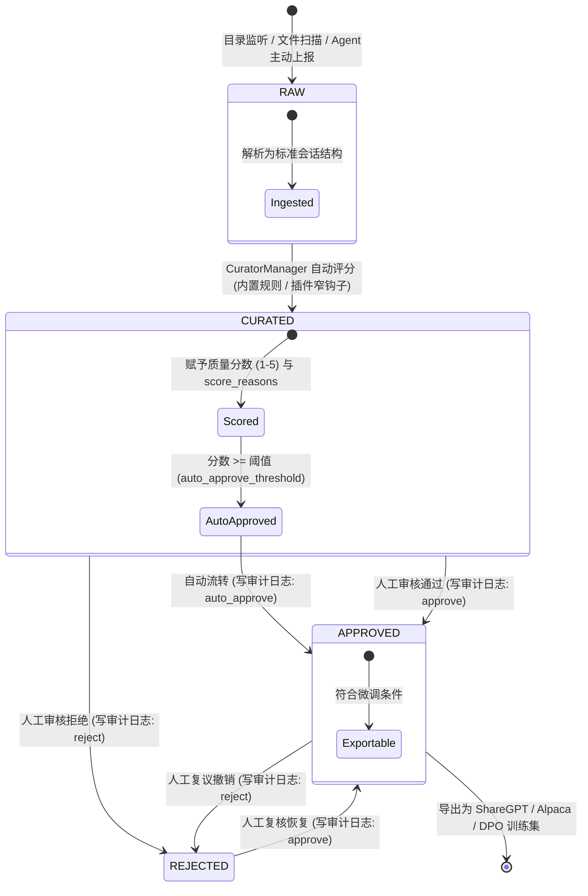
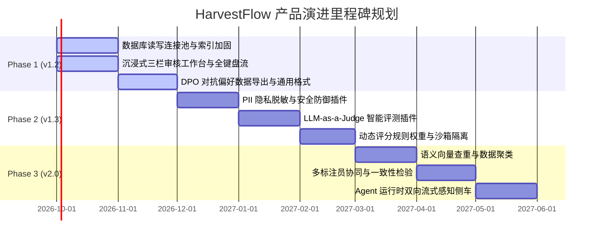

# HarvestFlow 产品深度调研与演进白皮书
> **Local-First AI Agent 会话数据精炼流水线架构与产品规划**
> 版本：v1.2.0-Draft | 状态：正式发布 | 编制：产品架构与 AI 数据工程团队

---

## 目录
1. [背景调查与行业趋势：Agent 时代的高质量数据困境与本地优先](#1-背景调查与行业趋势agent-时代的高质量数据困境与本地优先)
   - 1.1 大模型训练范式转移：从预训练海量语料到 Post-Training 精细化对齐
   - 1.2 Agent 落地过程中的“高噪声”真实交互数据困境
   - 1.3 数据安全合规与数据出境风险：本地优先（Local-First）沉淀企业核心数据资产
2. [开源同类产品深度对比与技术选型分析](#2-开源同类产品深度对比与技术选型分析)
   - 2.1 业界主流数据标注与 Tracing 平台概览（Argilla, Label Studio, Langfuse, OpenDataology）
   - 2.2 多维度横向对比矩阵
   - 2.3 核心差异剖析：为什么传统方案不适配 Agent 会话精炼？
3. [本产品定位与核心杀手级特点](#3-本产品定位与核心杀手级特点)
   - 3.1 一句话定位与产品边界
   - 3.2 核心杀手级特性（Killer Features）
   - 3.3 状态机模型与单向数据流闭环
4. [目标用户画像与核心应用场景](#4-目标用户画像与核心应用场景)
   - 4.1 用户画像一：私有化模型微调（SFT / DPO）工程师
   - 4.2 用户画像二：企业级知识库与 Agent 架构师
   - 4.3 用户画像三：专业数据标注员与领域专家（Domain Reviewers）
5. [当前代码与已实现功能深度盘点](#5-当前代码与已实现功能深度盘点)
   - 5.1 后端核心架构（backend/core 与 backend/managers）
   - 5.2 API 路由层（backend/api/v1）
   - 5.3 四类插件体系与 OpenClaw 双向打通
   - 5.4 前端体验层（frontend/src）
   - 5.5 测试与代码健康度度量
6. [现有功能强化与底层架构加固方案](#6-现有功能强化与底层架构加固方案)
   - 6.1 SQLite 并发性能瓶颈与连接池优化（WAL 模式深度调优）
   - 6.2 索引覆盖与超深分页查询性能优化
   - 6.3 自动评分引擎解耦、动态规则权重与沙箱隔离
7. [UI 与交互逻辑重塑（第一印象与审核效率极致优化）](#7-ui-与交互逻辑重塑第一印象与审核效率极致优化)
   - 7.1 当前工作台 UI 痛点审查
   - 7.2 高频键盘操作流（Keyboard-First Ergonomics）
   - 7.3 多轮 Agent 会话树形与时序调用可视化
   - 7.4 智能侧边差异高亮对比（Diff View）
   - 7.5 批量标注与特征筛选流重塑
8. [缺失关键功能补充与痛点攻坚](#8-缺失关键功能补充与痛点攻坚)
   - 8.1 痛点一：缺少 DPO 对抗偏好数据对（Pairwise Data）导出能力
   - 8.2 痛点二：敏感数据泄露风险——缺少 PII 隐私脱敏过滤引擎
   - 8.3 痛点三：跨生态格式壁垒——多格式双向无缝导入与导出
9. [未来分期演进路线图（P0 / P1 / P2）](#9-未来分期演进路线图p0--p1--p2)
   - 9.1 Phase 1 (v1.2 - P0: 稳定性、交互人体工学与格式互通)
   - 9.2 Phase 2 (v1.3 - P1: 数据脱敏、智能评测与可配置规则引擎)
   - 9.3 Phase 3 (v2.0 - P2: 语义去重、多标注员协同与主动流式反馈)
10. [结语与架构演进里程碑总结](#10-结语与架构演进里程碑总结)

---

## 1. 背景调查与行业趋势：Agent 时代的高质量数据困境与本地优先

### 1.1 大模型训练范式转移：从预训练海量语料到 Post-Training 精细化对齐
在经历参数规模（Scaling Law）军备竞赛后，大语言模型（LLM）的研发重心已全面转向 **后训练阶段（Post-Training）**。无论是行业模型定制还是专用领域 Agent，其最终能力边界不再单纯取决于无监督海量语料的摄入量，而决定于高阶指令微调（SFT, Supervised Fine-Tuning）与偏好对齐（DPO, Direct Preference Optimization / RLHF / RLVR / GRPO）。

根据近期业界（如 Meta Llama 3/4、DeepSeek-V3/R1、Qwen-2.5）的实践共识：
- **“高质量数据法则（Quality is All You Need）”**：1 万条经过严格清洗、思维链完整、工具调用无报错的高质量 SFT 真实数据，远胜 100 万条低质爬取或机械合成数据。
- **合成数据崩溃（Model Collapse）风险**：纯依赖前代 LLM 生成合成语料训练下一代模型，会导致信息熵衰减与尾部模式丢失；**真实生产环境中捕获的 Human-Agent 交互轨迹**，具备极高信息密度与真实复杂度，是避免模型同质化与幻觉的最宝贵资产。

### 1.2 Agent 落地过程中的“高噪声”真实交互数据困境
与传统的问答对话不同，AI Agent（如智能编程助理、工作流调度器、数据分析 Agent）在实际执行任务时呈现出高度复杂的多轮调用特征：
```
[User Input]
  → [Thought/Plan]
  → [Tool Use (参数构造)]
  → [Tool Result (API/Bash返回)]
  → [Reflection/Error Recovery]
  → [Final Output]
```
直接将生产环境中产生的大量 Agent 会话记录投喂给训练框架，会引发灾难性后果：
1. **执行循环与工具报错污染**：Agent 经常遭遇死循环、路径找不到、依赖缺少、网络超时（占真实会话 30%-50%）。如果将带有错误工具调用的负例误作为正例进行 SFT，模型将学会“自信地调用错误参数”。
2. **超长冗余上下文与低信噪比**：大量的中间工具调用输出（例如 `cat file.txt` 返回数千行日志）不仅撑爆上下文窗口，且稀释了核心推理逻辑。
3. **人类干预与反向纠偏的价值未被提取**：当 Agent 犯错时，用户往往会输入纠正指令（“不要用方法 A，改用方法 B 并重试”）。这类**天然的负例-正例对比**，是制作 DPO/RLHF 偏好数据集的绝佳来源，但由于缺乏结构化标注工具，这些高价值黄金对齐信号大量流失。

因此，**建立一套覆盖“目录监听采集 → 自动规则与模型启发式打分 → 人工高效复核 → 训练集一键导出”的全链路闭环**，已成为任何自研 Agent 团队的核心基础设施壁垒。

### 1.3 数据安全合规与数据出境风险：本地优先（Local-First）沉淀企业核心数据资产
在企事业单位、金融、政务、国防以及高壁垒研发场景中，Agent 交互数据包含大量高度敏感的资产：
- **企业核心资产**：源代码仓库结构、内部系统 API、数据库 Schema、未公开的战略规划；
- **个人隐私与身份信息（PII）**：员工凭据、客户手机号、身份证、内部网络拓扑；
- **合规审计要求**：国内《数据安全法》《个人信息保护法》《生成式人工智能服务管理暂行办法》以及欧盟《AI Act》《GDPR》对数据出境、数据留存与数据来源追溯设立了严格的红线。

**云端 SaaS 标注与 Tracing 平台的致命死穴**：
市面上诸多成熟产品（如 Langfuse Cloud、Scale AI、Argilla 托管版）均要求将客户端交互日志上报至外部云服务器。这在严肃企业合规审查中通常会被直接否决（一票否决权）。

**Local-First 架构的不可替代性**：
HarvestFlow 确立了 **“100% 数据不出机”** 的根本原则：
- 存储基于单机嵌入式 SQLite + 宿主机本地文件系统；
- 编排基于轻量 FastAPI 单机单进程或单容器部署；
- 无论网络是否隔离（Air-Gapped 环境），系统均能全功能运转；
- 只有本地优先，才能让算法团队与安全合规团队在无阻力前提下，将日常研发过程中沉淀的高价值 Agent 会话源源不断转化为模型微调资产。

---

## 2. 开源同类产品深度对比与技术选型分析

### 2.1 业界主流数据标注与 Tracing 平台概览
当前在 LLM 数据工程与可观测性领域，主要存在以下代表性开源解决方案：
1. **Argilla**：专注于 LLM 语料标注与 RLHF 偏好数据采集的成熟平台，紧密集成 HuggingFace 生态。
2. **Label Studio (Heartex)**：多模态数据标注领域的行业标杆，支持图像、音频、文本及 LLM 评估。
3. **Langfuse**：以 LLM 生产可观测性（Observability）、分布式链路追踪（Tracing）与 Prompt 管理见长的现代开发平台。
4. **Data-Juicer (Alibaba) / OpenDataology**：面向预训练及大规模 SFT 语料的大规模批处理、去重、清洗算子库。

### 2.2 多维度横向对比矩阵

| 评估维度 | **HarvestFlow** | **Argilla** | **Label Studio** | **Langfuse** | **Data-Juicer** |
| :--- | :--- | :--- | :--- | :--- | :--- |
| **产品核心定位** | 本地 Agent 会话精炼流水线 | LLM 交互标注与反馈系统 | 通用多模态标注平台 | LLM 应用链路追踪与评估 | 大规模语料离线过滤算子框架 |
| **部署重量与依赖** | **极轻量**：单容器/纯 Python，SQLite，<100MB 内存 | **中等偏重**：Docker Compose / K8s，依赖 ElasticSearch | **重**：PostgreSQL, Redis, Python Django | **重**：PostgreSQL, ClickHouse, Redis, Node.js | **批处理框架**：Ray / PySpark 分布式集群 |
| **网络与隐私属性** | **100% 本地优先**，无云回传，断网可用 | 自托管支持，但偏向团队协作与云集成 | 自托管支持，企业版推向 SaaS | 重点在 SaaS 与多租户自托管集群 | 本地/集群脚本运行 |
| **Agent 轨迹感知** | **原生深度支持**：识别 tool_use, tool_result, 决策链 | 弱：主要是单轮/多轮文本，对 Tool 调用无结构渲染 | 弱：需通过极其复杂的 XML 自定义配置支持 | **强**：支持调用链 Span 与 Trace 树状解析 | 无交互界面，仅离线过滤文本格式 |
| **流水线扩展机制** | **4类热插拔插件**（采集/清洗/审核/服务），前后钩子短路 | Python SDK / Webhook 监听 | Webhook / 自定义 ML Backend | OpenTelemetry / 外部 API 导出 | 自定义 Python Operator 批处理算子 |
| **自动评分体系** | **内置可解释启发式打分**（工具成功、决策链深度、代码产出） | 依赖外部挂载的反馈模型/人工打标 | 依赖外部 ML 辅助后端 | 基于 LLM-as-a-Judge 与规则指标 | 内置数百种统计与启发式过滤算子 |
| **训练集直接导出** | **一键直出**：ShareGPT、Alpaca、导出历史与打包下载 | 支持导出 HF Dataset，需二次脚本清洗 | 导出 JSON/CSV，需转换脚本适配微调框架 | 侧重 Metrics 分析，训练格式导出较繁琐 | 产出清洗后的 Parquet/JSONL |
| **硬件与上手门槛** | **0 门槛**：`docker compose up` 30 秒内拉起 | 需分配 2GB+ 内存供 ES 运行 | 需配置数据库连接与迁移 | 需部署至少 4 组容器，上手成本高 | 需掌握分布式算子与配置文件编写 |

### 2.3 核心差异剖析：为什么传统方案不适配 Agent 会话精炼？



1. **“观测（Tracing）”不等于“精炼（Curating）”**：
   - Langfuse 解决的是“线上 Agent 运行得怎么样、消耗了多少 Token、耗时多久”的 **Ops 问题**；
   - HarvestFlow 解决的是“如何把这成千上万个复杂的 Agent 调用轨迹，提炼成**下周模型微调能够直接吃进去的高质量训练集**”的 **Data Engineering 问题**。
2. **缺少专为 Agent 优化的“可解释启发式评分”**：
   - 现存标注工具普遍需要人工为每条对话逐项打分，或者直接使用昂贵且不可控的云端 LLM-as-a-Judge；
   - HarvestFlow 提出结合轻量规则与上下文特性的分级过滤（工具调用是否有实际执行并返回正确结果、是否包含完整多步推理、是否有明确代码交付物），在数据入库瞬间即可剔除 60% 以上的明显废料。
3. **架构臃肿度与私有化交付鸿沟**：
   - 大多数平台为了多租户和检索灵活性引入了 ElasticSearch、ClickHouse 或 Redis，单机启动需占用数 GB 内存；
   - HarvestFlow 坚守轻量单机理念，极度克制地选用 SQLite WAL + 统一 Python 依赖，使独立开发者和中小企业算法小组能在自己的工作站或内网服务器上一键即启。

---

## 3. 本产品定位与核心杀手级特点

### 3.1 一句话定位与产品边界
> **HarvestFlow 是一款面向 AI Agent 的本地优先（Local-First）会话数据精炼流水线系统。它通过“全自动监听采集 → 可解释多维评分 → 人体工学人工复核 → 一键导出训练集”的端到端闭环，帮助微调团队与 Agent 开发者将散落且高噪声的交互执行轨迹，安全、高效地转化为黄金对齐资产。**

**产品边界（Non-Goals）**：
- **不做云端多租户 SaaS**：不引入复杂的权限体系、配额计费与组织架构；
- **不做底层 Agent 运行框架**：不替代 LangChain、AutoGPT 或 OpenClaw，仅作为 Agent 的侧车数据沉淀基础设施；
- **不做模型训练器**：不内置 PyTorch / Deepspeed 训练逻辑，专注无缝对接 LLaMA-Factory, Axolotl, Unsloth 等微调生态。

### 3.2 核心杀手级特性（Killer Features）
1. **100% 数据不出机（Zero Egress & Air-Gapped Ready）**
   - 架构基于 FastAPI + 单机 SQLite WAL + 本地文件系统。
   - 前后端均支持静态内网打包，无外部 CDN 依赖，无隐蔽遥测上报，物理级杜绝数据出境风险。
2. **4 类热插拔插件流水线架构（Collector / Curator / Reviewer / Service）**
   - 采用前后窄钩子（Before/After Hooks）与短路机制（Short-Circuiting）；
   - 用户接入新的数据源（如 Claude Code 日志、Dify 导出）只需编写单个 Collector 插件；接入私有化打分模型只需挂载 Curator 钩子；扩展人工复核字段无需修改前端代码，由 Reviewer 插件 Schema 动态渲染。
3. **可解释、高信噪比的自动评分引擎**
   - 绝非黑盒打分，原生注入 `score_reasons`（如“基础分 2分”、“成功调用工具 +1分”、“包含 ≥3 轮深度决策链 +1分”、“输出包含有效代码块 +1分”）；
   - 支持高价值自动判定（`is_high_value`）与阈值自动放行（Auto-approve），大幅缩减人工审核量 70% 以上。
4. **严格的有限状态机（FSM）与唯一落库看门狗**
   - 严格杜绝非法状态漂移：`raw → curated → approved / rejected`；
   - 所有的审批与回写统一收敛至 `SessionManager.apply_review()` 唯一入口，原子性绑定审计日志（Audit Logs），保证全生命周期数据操作可追溯、防篡改。
5. **微调框架原生兼容的导出体系**
   - 支持 ShareGPT（多轮 `from`/`value` 对话）与 Alpaca（`instruction`/`input`/`output`）格式；
   - 导出记录全留痕，支持基于分数、标签、角色、任务类型的精细化切片，支持单文件下载与内存 Zip 打包。

### 3.3 状态机模型与单向数据流闭环



---

## 4. 目标用户画像与核心应用场景

### 4.1 用户画像一：私有化模型微调（SFT / DPO）工程师
- **典型特征**：算法工程师、大模型训练负责人，使用 LLaMA-Factory / Axolotl 等框架在本地服务器训练 7B~70B 开源模型。
- **痛点**：
  - 手工写 Python 脚本转换日志，经常因为 JSON 格式嵌套、空消息、工具返回中夹杂转义字符而导致训练中断；
  - 缺乏质量过滤，人工肉眼查阅几百个 JSON 效率极低；
  - 找不到现成高质量多轮工具调用的对抗数据对（DPO Pairwise）。
- **HarvestFlow 解决方案**：
  - 开启自动监听，日志放入目录即自动导入并打标；
  - 设置高分阈值一键导出符合微调要求的 ShareGPT 格式文件，直接喂给训练脚本；
  - 配合 DPO 配对导出功能，快速抽取好-坏决策样本。

### 4.2 用户画像二：企业级知识库与 Agent 架构师
- **典型特征**：AI 解决方案架构师，为企业构建客服 Agent、代码助手 Agent 或企业数据分析 Agent。
- **痛点**：
  - 内部业务系统交互数据无法上云，找不到能私有化部署在内网开发机上的轻量级会话管理软件；
  - 线上 Agent 偶尔答非所问或工具调用失败，需要将失败样本精准抓出进行 Bad Case 分析；
  - 需要打通与 OpenClaw 等 Agent 运行时的双向连接。
- **HarvestFlow 解决方案**：
  - 使用本地单容器部署，秒级拉起；
  - 通过 OpenClaw 插件实现 Agent 在交互结束后主动上报轨迹；
  - 基于标签和任务类型过滤 Bad Case，驱动 Agent 提示词（System Prompt）与 Few-Shot 样本迭代。

### 4.3 用户画像三：专业数据标注员与领域专家（Domain Reviewers）
- **典型特征**：数据治理团队专员、代码/法律/金融领域的业务专家，负责对 AI 输出的严谨性进行最终兜底。
- **痛点**：
  - 传统标注软件界面卡顿，对复杂代码块没有高亮，对 JSON 数据折叠效果差；
  - 依赖鼠标点击，平均复核一条数据需要 30 秒，双手频繁在键盘和鼠标之间切换，容易疲倦且易出错；
  - 缺乏针对领域维度的打标表单（例如“是否存在事实性幻觉”、“代码是否包含安全漏洞”）。
- **HarvestFlow 解决方案**：
  - 全键盘操作（A/R 键审批通过与拒绝、1-5 键直接打分、J/K 上下翻条）；
  - Reviewer 插件提供动态 Schema 表单，按需定制领域评估字段并实时落库。

---

## 5. 当前代码与已实现功能深度盘点

经过对当前代码库（版本 v1.1.0）的全面审查，系统架构成熟度极高，代码结构严谨，测试覆盖充分。以下是核心代码资产盘点：

### 5.1 后端核心架构（backend/core 与 backend/managers）
- **基础设施层 (`backend/core`)**：
  - [`database_manager.py`](file:///home/mcocdaa/AI_CODE/HarvestFlow/backend/core/database_manager.py)：统一 SQL 操作入口。启用 SQLite WAL 日志模式；采用 `_ensure()` 统一连接断言与 `_write()` 统一写锁机制（`threading.Lock`）；实现 `session_review_apply()` 原子事务（更新状态 + 写入审计日志）；使用 `PRAGMA table_info` 保证无损 schema 平滑迁移。
  - [`hook_manager.py`](file:///home/mcocdaa/AI_CODE/HarvestFlow/backend/core/hook_manager.py)：实现了基于 Priority 的同步/异步双分发切面系统。支持 `@wrap_hooks(before=..., after=...)`；before 钩子非 None 时短路原逻辑，after 钩子链式递进修改结果。
  - [`plugin_manager.py`](file:///home/mcocdaa/AI_CODE/HarvestFlow/backend/core/plugin_manager.py)：实现基于 `plugins.yaml` 的动态注册表，支持热插拔启停；禁用插件仍能读取并保留清单元数据（Manifest）；保证运行期配置文件安全写回。
  - [`setting_manager.py`](file:///home/mcocdaa/AI_CODE/HarvestFlow/backend/core/setting_manager.py)：统一管理环境变量与 CLI 参数，建立收敛的 `DEFAULTS` 字典，杜绝魔法值散落。
  - [`secrets_manager.py`](file:///home/mcocdaa/AI_CODE/HarvestFlow/backend/core/secrets_manager.py)：可扩展密钥管理抽象，预留并接入了 Infisical 等外部密钥系统。
  - [`constants.py`](file:///home/mcocdaa/AI_CODE/HarvestFlow/backend/core/constants.py)：以 `StrEnum` 严格定义 `SessionStatus`（`raw`, `curated`, `approved`, `rejected`）与 `ExportFormat`（`sharegpt`, `alpaca`）。
- **业务逻辑层 (`backend/managers`)**：
  - 继承自统一基类 `BaseManager`，生命周期包含 `register_arguments()` 与 `init()`。
  - [`session_manager.py`](file:///home/mcocdaa/AI_CODE/HarvestFlow/backend/managers/session_manager.py)：实现了严格的有限状态机校验字典 `VALID_STATUS_TRANSITIONS`；作为唯一审批入口 `apply_review()` 杜绝绕过校验；提供数据库记录与磁盘源文件的联动物理删除。
  - [`collector_manager.py`](file:///home/mcocdaa/AI_CODE/HarvestFlow/backend/managers/collector_manager.py)：支持单文件解析与文件夹全量扫描；实现基于 `watch_folders.json` 的监听目录持久化；具备后台守护线程（轮询采集）机制。
  - [`curator_manager.py`](file:///home/mcocdaa/AI_CODE/HarvestFlow/backend/managers/curator_manager.py)：构建了清晰的执行模板（`_validate_for_evaluation` → `_score` → 回写落库 → 自动放行判断）；开放 `curator_manager_score_before` 窄钩子，使插件只需实现纯评分算法。
  - [`reviewer_manager.py`](file:///home/mcocdaa/AI_CODE/HarvestFlow/backend/managers/reviewer_manager.py)：提供逐条待审、批量审批、多条件审计日志聚合，并通过钩子聚合 Reviewer 插件的扩展字段 Schema。
  - [`exporter_manager.py`](file:///home/mcocdaa/AI_CODE/HarvestFlow/backend/managers/exporter_manager.py)：负责将已批准（`approved`）数据转换为 ShareGPT 或 Alpaca 标准 JSONL；记录包含精细过滤条件的导出历史；提供带路径穿越防护的单文件流式下载与内存 Zip 打包。

### 5.2 API 路由层（backend/api/v1）
- 由 [`router_loader.py`](file:///home/mcocdaa/AI_CODE/HarvestFlow/backend/api/v1/router_loader.py) 动态遍历挂载，遵循 RESTful 风格与一致的响应格式（[`common.py`](file:///home/mcocdaa/AI_CODE/HarvestFlow/backend/api/v1/common.py) 的 `ok()`, `not_found()`, `bad_request()`）。
- 具备可选的 Bearer API Token 鉴权中间件（保护所有业务端点，开放 `/health`）。
- 六组核心端点完整对应系统生命周期：`/sessions`、`/stats`、`/collector`、`/curator`、`/reviewer`、`/exporter`、`/plugins`。

### 5.3 四类插件体系与 OpenClaw 双向打通
- **插件架构**：所有插件均存放于 `plugins/{type}/{name}/`，具备标准的 `plugin.yaml`（元数据）、`hooks.py`（钩子声明）、`backend.py`（业务实现）。
- **已落地插件**：
  1. `collectors/openclaw`：深度适配 OpenClaw v3 嵌套事件格式与旧版扁平行格式，具备 Windows 路径跨平台 POSIX 兼容回退。
  2. `curators/openclaw`：提供包含决策链、工具调用、输出代码块在内的多维可解释评分。
  3. `reviewers/example`：示范动态字段扩展（安全审核、幻觉评级）与提交前合法性校验。
  4. `services/infisical`：密钥管理云端同步。
  5. `plugin-openclaw-to-harvestflow`：扩展子模块，向 Agent 端暴露 `harvestflow_*` 工具，赋予 Agent 主动向系统上报并查询会话的能力。

### 5.4 前端体验层（frontend/src）
- 基于现代化技术栈：**React 19 + TypeScript + Vite 8 (Rolldown) + Ant Design 5 + ProComponents + Recharts**。
- 完整实现了 6 个高质量交互页面：
  - **概览 (Dashboard)**：状态分布环形图、通过率雷达、待审直达快捷卡、清洗器状态监控与一键触发。
  - **会话 (Sessions)**：集成 ProTable，支持按状态、角色筛选与多字段排序，支持抽屉式对话详情浏览、单条自动评分与流转编辑。
  - **审核 (Review)**：包含单条沉浸式工作台（`ReviewWorkspace`）、批量处理看板（`BatchReviewPanel`）与可过滤的全局审计日志抽屉（`AuditLogDrawer`）。
  - **采集 (Collect)**：监听目录实时管理、轮询状态与手动触发、目录深度扫描与批量入库结果反馈。
  - **导出 (Export)**：动态加载导出格式、预填常用标签与角色过滤器、历史导出记录卡片与单文件/Zip 下载。
  - **插件 (Plugins)**：按类型聚合的卡片墙，支持安全启停切换。
- 具备动态 Schema 渲染组件（文本、数字、下拉框、复选框、多行文本），无缝呈现后端 Reviewer 插件的自定义审核项。

### 5.5 测试与代码健康度度量
- **后端测试**：Pytest 覆盖 389 个测试用例，涵盖 Core 基础设施、各 Manager 业务分支、Hook 机制、API 边界以及插件回退，测试耗时约 28s，**测试通过率 100%**。
- **前端测试**：Vitest 覆盖 15 个测试套件，111 个断言用例，覆盖组件渲染、状态流转、异步数据加载、快捷键绑定与表单交互，**测试通过率 100%**。
- **构建与规范**：TypeScript 编译零错误，Ruff 代码规范检查全面通过，单文件 Dockerfile 与 Docker Compose 经过生产级多环境验证。

---

## 6. 现有功能强化与底层架构加固方案

尽管当前系统在逻辑闭环与代码规范上表现优异，但面对高并发 Agent 写入以及上万级会话沉淀场景，仍存在以下需要加固的架构要点：

### 6.1 SQLite 并发性能瓶颈与连接池优化（WAL 模式深度调优）
- **当前瓶颈**：
  在 `DatabaseManager` 中，系统维护了一个全局单一的 `self.connection`（开启 `check_same_thread=False`），并使用 Python 层的单一互斥锁 `self._write_lock` 对写操作进行保护。
  - 虽然 SQLite WAL 允许读写并发，但在单一共享连接模式下，读取和写入实际上在竞争同一连接的游标；
  - 当外部目录监听器批量导入 500 个文件，或者多个 Agent 同时触发 API 上报时，写入锁会持有较长时间，导致前端的读请求出现明显的排队延迟甚至 `sqlite3.OperationalError: database is locked`。
- **加固方案**：
  1. **读写分离连接模型**：
     - 保留 1 个独占的“写连接（Write Connection）”，受专用线程锁或排他队列控制；
     - 建立一个轻量级“读连接池（Read Connection Pool）”（如基于 `queue.Queue` 维护 4-8 个只读连接），所有 `SELECT` 操作从池中借出连接，互不阻塞。
  2. **PRAGMA 级性能参数加固**：
     ```sql
     PRAGMA journal_mode = WAL;
     PRAGMA synchronous = NORMAL;      -- 在保证数据完整性前提下大幅减少 fsync 频次
     PRAGMA busy_timeout = 10000;      -- 锁等待超时拉长至 10 秒，消除突发冲突
     PRAGMA cache_size = -64000;       -- 扩大页缓存至 64MB
     PRAGMA temp_store = MEMORY;       -- 临时表与排序全部在内存中进行
     ```

### 6.2 索引覆盖与超深分页查询性能优化
- **当前瓶颈**：
  检查 `_initialize_tables()` 发现，`sessions` 表仅有 `session_id` 主键索引，`audit_logs` 与 `export_records` 仅有自增 `id` 主键：
  - 当数据量达到 5 万条以上时，前端最核心的查询：
    `SELECT ... FROM sessions WHERE status = ? ORDER BY created_at DESC LIMIT 20 OFFSET 1000;`
    需要对全表进行 Scan 与 Filesort，耗时将从 2ms 骤升至数百毫秒。
  - `audit_logs` 按 `session_id` 查询也缺少索引支持。
- **加固方案**：
  在数据库初始化时增加精准覆盖索引（Covering Indexes）：
  ```sql
  -- 状态与时间复合索引（优化会话列表与待审核队列）
  CREATE INDEX IF NOT EXISTS idx_sessions_status_created
    ON sessions(status, created_at DESC);

  -- 导出过滤专用复合索引
  CREATE INDEX IF NOT EXISTS idx_sessions_export_filter
    ON sessions(status, quality_manual_score, quality_auto_score);

  -- 审计日志会话索引
  CREATE INDEX IF NOT EXISTS idx_audit_logs_session
    ON audit_logs(session_id, created_at DESC);

  -- 导出记录时间索引
  CREATE INDEX IF NOT EXISTS idx_export_records_created
    ON export_records(created_at DESC);
  ```
  同时，针对深度分页引入**游标分页（Keyset Pagination）**支持：
  `WHERE (created_at, session_id) < (:last_created_at, :last_session_id) ORDER BY created_at DESC LIMIT :page_size`，彻底消除大 `OFFSET` 带来的性能坍塌。

### 6.3 自动评分引擎解耦、动态规则权重与沙箱隔离
- **当前瓶颈**：
  当前打分规则硬编码在 Python 代码中（例如 `plugins/curators/openclaw/backend.py` 内部硬编码了 `MIN_DECISION_CHAIN_LENGTH = 3`、`code_block_count >= 2` 等常数）。
  - 不同的业务场景对优质对话的定义完全不同（代码类 Agent 关注代码块，客服类 Agent 关注礼貌度与解答准确率，分析类 Agent 关注工具调用链）；
  - 团队若想调权，必须直接修改插件源代码；
  - 缺少对插件评分执行超时的保护，恶意或死循环的复杂正则可能阻塞核心流水线。
- **加固方案**：
  1. **声明式规则权重配置（Configurable Rubric Engine）**：
     通过 YAML/JSON 或前端配置项动态配置评分规则卡：
     ```yaml
     ruleset:
       name: "coding_agent_evaluator"
       base_score: 2
       criteria:
         - rule: "tool_success"
           weight: 1.0
           description: "所有工具调用均无 error 返回"
         - rule: "decision_chain"
           param: { min_rounds: 3 }
           weight: 1.0
         - rule: "code_output"
           param: { min_code_blocks: 1 }
           weight: 1.0
         - rule: "penalty_repetition"
           param: { max_repeated_turns: 2 }
           weight: -2.0
       auto_approve_threshold: 4
     ```
  2. **执行隔离与超时沙箱**：
     在 `curator_manager` 调度评分钩子时，使用 `asyncio.wait_for(..., timeout=5.0)` 限制单条会话评分最长耗时，超时则自动记录警告并回退至默认分，防止流水线卡死。

---

## 7. UI 与交互逻辑重塑（第一印象与审核效率极致优化）

标注审核是数据工程中最昂贵的人力环节。一个优秀的工作台必须具备**“低认知负荷、高信息密度、极速键盘流”**的特点。

### 7.1 当前工作台 UI 痛点审查
审查当前 `ReviewWorkspace.tsx` 与交互模式，存在以下直接影响效率的痛点：
1. **信息布局单列垂直堆叠**：对话内容和审核表单上下排列，当对话很长时，底部的打分与提交按钮被挤出屏幕，审核员需要频繁上下滚动页面。
2. **快捷键覆盖度不足**：目前仅绑定了 `Cmd+Enter`（通过）与 `Cmd+Backspace`（拒绝）。审核员给出的 1-5 星评分依然必须通过鼠标点击 Radio 或 Rate 组件，无法达成纯键盘“盲打”操作。
3. **缺少上下文概览与快速跳转**：审核员无法一眼感知整个待审队列中每条数据的规模（如当前会话包含 30 轮交互还是 2 轮？是否使用了网络搜索？），只能一条条被动加载。
4. **工具调用信息过于扁平**：复杂的 `tool_calls` 参数与巨大的返回日志与对话气泡混排在一起，界面视觉信噪比失衡。

### 7.2 高频键盘操作流（Keyboard-First Ergonomics）
重塑审核工作台为**沉浸式专业 Triage 终端**，引入专业全键盘流体系：

| 按键 / 组合键 | 交互行为 | 业务逻辑与防呆设计 |
| :--- | :--- | :--- |
| `A` 或 `Cmd + Enter` | **通过（Approve）** | 立即标记为 approved，自动切换到下一条；附带当前评分与填写的备注 |
| `R` 或 `Cmd + Backspace` | **拒绝（Reject）** | 弹出快速原因选择气泡或直接拒审，自动流转至下一条 |
| `1` ~ `5` | **快速评分（Score 1-5）** | 数字键一键设定质量评分，UI 视觉指示灯同步点亮 |
| `J` / `K` 或 `↓` / `↑` | **下/上一条（Next / Prev）** | 队列内游标切换，保持当前编辑状态缓存 |
| `E` | **编辑修正（Edit Mode）** | 快捷激活当前 Assistant 回复的富文本编辑态，修正幻觉或错别字 |
| `T` | **切换工具折叠（Toggle Tools）** | 一键展开/折叠所有消息内的 `tool_use` 与 `tool_result` 细节 |
| `?` | **帮助手册（Cheat Sheet）** | 唤起半透明键盘快捷键全览浮层 |

*防呆机制*：当焦点处于 `Input`、`TextArea` 或其他表单控件内部时，单字符快捷键（如 `A`, `R`, `1-5`）自动屏蔽，仅保留 `Cmd/Ctrl` 组合键，防止打字冲突。

### 7.3 多轮 Agent 会话树形与时序调用可视化
针对现代 Agent 的分支重试、工具回显与反思，设计三栏式专业工作台布局：

```
┌─────────────────────────────────────────────────────────────────────────────────────────────┐
│ HarvestFlow 沉浸式审核工作台                                       [待审核队列: 42 条] [?]    │
├──────────────────┬──────────────────────────────────────────┬───────────────────────────────┤
│ 队列导航 (左栏 20%) │ 对话与推理执行流 (中栏 55%)                │ 决策面板 (右栏 25% 悬浮置顶)  │
├──────────────────┼──────────────────────────────────────────┼───────────────────────────────┤
│ 🔍 搜索/筛选      │ 👤 User:                                  │ 🎯 质量评估                    │
│ ──────────────── │   请帮我重构 database.py 并加上缓存         │ 评分: ★★★★☆ (当前: 4分)       │
│ ▶ #1 84a9c1      │ ──────────────────────────────────────── │ 快捷键: [1][2][3][4][5]       │
│   Score: 4 | 12条 │ 🤖 Assistant (Thought):                  │ ───────────────────────────── │
│   [Tool: Bash]   │   首先阅读文件，定位现有类结构...          │ 🏷️ 标签体系                    │
│                  │ ──────────────────────────────────────── │ [Python] [Refactor] [+新增]   │
│   #2 b73ef0      │ ⚙️ Tool Call: `read_file`                 │ ───────────────────────────── │
│   Score: 2 | 3条  │   path: "/backend/database.py"           │ 🧩 扩展插件属性 (Reviewer)     │
│   [无工具]        │   ▶ 展开返回 (142 行代码)                 │ 是否存在幻觉: [否]            │
│                  │ ──────────────────────────────────────── │ 代码可执行度: [完全可执行 ▼]   │
│   #3 91c4d2      │ 🤖 Assistant (Output):                   │ ───────────────────────────── │
│   Score: 5 | 28条 │   已完成重构，使用 lru_cache 增加了...     │ 📝 审核备注 (选填)             │
│   [Tool: Git]    │   ```python                              │ [输入快捷原因或输入文字...]   │
│                  │   def get_db(): ...                      │ ───────────────────────────── │
│                  │   ```                                    │ [ R 拒绝 (Cmd+Del) ]          │
│                  │                                          │ [ A 通过 (Cmd+Enter) ]        │
└──────────────────┴──────────────────────────────────────────┴───────────────────────────────┘
```

### 7.4 智能侧边差异高亮对比（Diff View）
在人工标注流程中，“人工修正 Assistant 错误回答”是产生高质量 SFT 数据最关键的动作：
- 在气泡右上方增加“修改回答”按钮；
- 编辑保存后，界面无缝切换为 **Side-by-Side 或 Inline Diff 模式**；
- 绿色高亮新增纠偏文本，红色删除线标识原错误模型输出；
- 该 Diff 记录将直接作为构建 DPO 偏好对的原料（被修改前为 `rejected`，修改后为 `chosen`）。

### 7.5 批量标注与特征筛选流重塑
- **智能预选器（Smart Selectors）**：
  在 `BatchReviewPanel` 顶部提供快速选择宏：
  - “勾选所有：自动评分 ≥ 4 且无任何报错的会话”（适合大批量极速过审）；
  - “勾选所有：消息轮数 < 2 的单轮无用会话”（适合一键批量拒绝清理垃圾）。
- **批量标签与元数据注入**：
  支持对多选的数十条数据一键追加业务标签（如统一打上 `batch_v1.2_finance`），大幅减少重复操作。

---

## 8. 缺失关键功能补充与痛点攻坚

要使 HarvestFlow 成为不可替代的 AI 数据基础设施，必须针对当前版本的核心痛点，补充三项战略级功能：

### 8.1 痛点一：缺少 DPO 对抗偏好数据对（Pairwise Data）导出能力
- **行业痛点**：
  仅做 SFT 会导致模型难以学习“什么是好的决策，什么是不良的幻觉”。当前主流开源对齐训练（如 Direct Preference Optimization, ORPO, SimPO）急需符合规范的二元组/三元组偏好数据：
  `{ prompt, chosen, rejected }`。
- **攻坚方案**：
  1. **数据源发现算法**：
     - *模式 A（人工修改对）*：如果某条会话中，标注员对 Assistant 消息执行了在线编辑，则 `原内容` 自动标记为 `rejected`，`修正后内容` 标记为 `chosen`；
     - *模式 B（同 Prompt 双候选对）*：当同一 Task 或 User Prompt 存在两次执行会话，其中一条被 `approved`，另一条被 `rejected` 时，自动将其根据上下文相似度匹配为 Pairwise 对。
  2. **DPO 格式导出器（`dpo` 格式）**：
     在 `exporter_manager` 中注册 `ExportFormat.DPO`，一键生成 HuggingFace / LLaMA-Factory 原生支持的标准格式：
     ```json
     {
       "conversations": [
         {"from": "user", "value": "写一个快速排序算法"}
       ],
       "chosen": {
         "from": "assistant",
         "value": "def quicksort(arr): ..."
       },
       "rejected": {
         "from": "assistant",
         "value": "这是快速排序的代码：def sort(arr): return arr"
       }
     }
     ```

### 8.2 痛点二：敏感数据泄露风险——缺少 PII 隐私脱敏过滤引擎
- **行业痛点**：
  开发者与 Agent 协作时，终端常常输出机密内容（AWS AccessKey、OpenAI API Key、私有 IP、公司员工真实姓名与密码）。一旦这些数据被直接导出进入训练集，微调后的模型将在推理中对用户产生严重的“记忆泄露（Data Leakage）”。
- **攻坚方案**：
  实现内置的 **Cleaner 插件：`plugins/cleaners/pii_anonymizer/`**。
  - **规则与模式匹配层**：
    - 高熵密钥探测：识别 `sk-[a-zA-Z0-9]{32,}`、`AKIA[0-9A-Z]{16}`、JWT Token、私钥文件头；
    - 常见 PII 正则：中国大陆手机号（`1[3-9]\d{9}`）、身份证号、电子邮件、内网私有 IP（`10.x.x.x`, `192.168.x.x`）。
  - **可逆/单向脱敏策略**：
    - 替换为占位符标记：`[API_KEY_REDACTED]`, `[EMAIL_1]`, `[PHONE_1]`；
    - 在会话入库清洗阶段或导出阶段，根据配置提供“强制脱敏”、“阻断入库”或“打上 PII 警告标签交由人工复审”三种策略。

### 8.3 痛点三：跨生态格式壁垒——多格式双向无缝导入与导出
- **行业痛点**：
  当前系统采集侧仅支持扫描本地 JSON 与 OpenClaw JSONL；导出仅支持 ShareGPT 与 Alpaca。用户如果有存量的开源数据集（如 HuggingFace 上的 ShareGPT 数据集），无法导入 HarvestFlow 进行二次微调筛选与审核；也无法直接导出为 OpenAI 原生微调消息格式。
- **攻坚方案**：
  1. **通用双向格式支持矩阵**：

| 数据格式 | 导入能力 (Collector) | 导出能力 (Exporter) | 适用典型生态 |
| :--- | :--- | :--- | :--- |
| **OpenAI Messages** | ✅ 支持 (含 `tool_calls`) | ✅ 支持 (`role: system/user/assistant`) | OpenAI Fine-Tuning, vLLM, SGLang |
| **ShareGPT** | ✅ 支持 (反向解析多轮 `conversations`) | ✅ 原生支持 (`from: human/gpt`) | FastChat, LLaMA-Factory, Axolotl |
| **Alpaca** | ✅ 支持 (`instruction/input/output`) | ✅ 原生支持 | 经典单轮与指令微调 |
| **DPO Pairwise** | ⏸️ 待支持 | ✅ 新增支持 (`chosen / rejected`) | DPO / PPO / KTO 偏好对齐训练 |
| **OpenClaw v3** | ✅ 原生深度支持 | ➡️ 转换为通用格式导出 | OpenClaw Agent 生态 |

  2. **前端一键文件拖拽导入器**：
     在前端“采集”页增加拖拽上传卡片，支持用户直接将 `.json` 或 `.jsonl` 拖入浏览器，后端自适应嗅探数据格式，完成结构标准化并进入 `raw` 状态队列。

---

## 9. 未来分期演进路线图（P0 / P1 / P2）

结合已有的 [`future_plan.md`](file:///home/mcocdaa/AI_CODE/HarvestFlow/future_plan.md) 与本次产品架构调研，规划三期清晰、可验证的演进路线图：



### 9.1 Phase 1 (v1.2 - P0: 稳定性、交互人体工学与格式互通)
**核心目标**：彻底消灭高负载下的数据库瓶颈，将人工复核效率提升 3 倍，打通 DPO 偏好对齐导出闭环。

- **后端工程加固**：
  1. 实施 SQLite 读写分离模型与连接池，引入 `idx_sessions_status_created` 等核心复合索引；
  2. 实现 Keyset 游标分页，保证 10 万+ 会话量下分页请求平稳在 5ms 以内；
  3. 收敛 `hook_manager` 同步/异步分发逻辑，消除潜在的事件循环阻塞风险。
- **前端交互重塑**：
  1. 重构 `ReviewWorkspace.tsx` 为三栏紧凑布局（左队列、中会话流、右固钉决策面板）；
  2. 落地全键盘操作流（A/R 审批流转、1-5 数字评分、J/K 切换上下条）；
  3. 优化复杂工具调用的视觉呈现，默认折叠过长日志，突出核心入参与执行状态。
- **业务功能增强**：
  1. 落地 `ExportFormat.DPO` 偏好格式导出与下载；
  2. 扩展 `exporter_manager` 支持 OpenAI 标准 Messages 格式；
  3. 采集页支持标准 ShareGPT / Alpaca 格式文件的直接扫描与反向导入。

### 9.2 Phase 2 (v1.3 - P1: 数据脱敏、智能评测与可配置规则引擎)
**核心目标**：保障企业数据隐私绝对安全，引入本地模型自动初评，实现评分规则零代码调整。

- **数据安全合规**：
  1. 实现 `plugins/cleaners/pii_scrubber` 脱敏插件，支持高熵密钥与敏感 PII 的自动遮蔽；
  2. 增加会话合规检查机制，在导出时自动拦截未脱敏会话。
- **智能化初评（AI-assisted Curation）**：
  1. 开发 `plugins/curators/llm_judge` 插件，支持调用本地 Ollama / vLLM 兼容端点（如 Qwen2.5-Coder-7B）对 Agent 轨迹进行深层次逻辑严谨性评测；
  2. 评测结果输出细粒度维度分（逻辑连贯性、工具准确性、无害性），并融合至 `score_reasons`。
- **规则引擎动态化**：
  1. 前端提供“打分规则配置”可视化界面，允许用户动态增减启发式规则与权重比例；
  2. 评分逻辑沙箱化，引入超时看门狗，防止畸变数据拖垮评分流水线。

### 9.3 Phase 3 (v2.0 - P2: 语义去重、多标注员协同与主动流式反馈)
**核心目标**：应对海量数据集的去重与精细化管理，支持多专家协同复核与实时 Agent 数据吞吐。

- **向量化与语义去重**：
  1. 引入嵌入式轻量向量检索库（如 SQLite-Vec 或 Chromadb-lite），使用轻量本地 Embedding 模型（如 bge-small-zh）提取 User Intent 向量；
  2. 自动识别并过滤高度重复的模板化对话，优先挑选语义分布稀缺的“高信息熵”会话供人工审核。
- **多角色复核与协同仲裁**：
  1. 引入双人背靠背复核（Blind Double-Review）模式；
  2. 自动计算标注员一致性系数（Cohen's Kappa），针对分歧样本自动升级至专家仲裁池。
- **Agent 双向流式侧车（Sidecar Protocol）**：
  1. 提供轻量 Python SDK 与 WebSocket/gRPC 接入协议，支持 Agent 框架在运行中以流式方式近实时上报执行轨迹，打造真正意义上的数据自动沉淀与反哺飞轮。

---

## 10. 结语与架构演进里程碑总结

作为一款诞生于 AI Agent 落地深水区的专用工具，**HarvestFlow 抓住了大模型从“暴力扩大参数”走向“精细化工程对齐”的历史契机**。它不盲目追求复杂的分布式微服务体系，而是精准切中“数据安全合规（Local-First）”、“Agent 决策链感知（Trace-Aware）”与“全链路可解释精炼（Curated Pipeline）”这三大核心杀手级需求。

通过执行本次规划中的性能加固、全键盘交互重塑以及 DPO / PII 核心能力攻坚，HarvestFlow 将从一个优秀的会话采集小工具，正式进化为**开源世界中首屈一指的私有化 AI Agent 数据资产精炼平台**，为每一位重视数据质量与主权的开发者，铸造最坚固的模型对齐基石。
